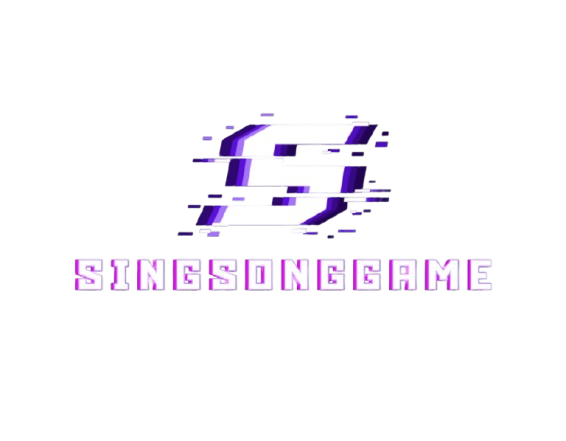

# SingSong Game

<div align="center">
  
  
  **실시간 멀티플레이 노래 맞추기 게임**<br><br>
  _노래로 놀자!_<br>
  _친구들과 함께하는 즐거운 음악 퀴즈 게임!_
</div>

<br/>

## 🔗 Links
- 🌐 **웹사이트**: [https://singsonggame.store](https://singsonggame.store)
- 🎥 **시연 영상**: Coming Soon

<br/>

## ✨ 주요 기능

### 🎮 실시간 멀티플레이어
여러 플레이어가 동시에 참여하여 실시간으로 경쟁할 수 있는 게임 시스템

### 🎯 다양한 게임 모드
- **AI TTS 게임**: TTS가 읽어주는 가사를 듣고 노래의 제목을 맞추는 게임
- **랜덤 게임**: 키워드에 맞는 랜덤의 노래를 재생하고 빠르게 맞추는 게임
- **키싱유**: 키워드에 맞는 노래를 10초간 불러서 점수를 획득하는 게임

### 🏆 실시간 점수 시스템
빠른 정답으로 높은 점수를 획득하고 실시간 스코어보드로 순위 확인

### 💬 실시간 채팅
게임 중 다른 플레이어들과 실시간 소통 가능

### 🎼 오디오 시스템
게임 BGM과 효과음으로 몰입감 있는 게임 경험

<br/>

## 🛠 기술 스택

### 프론트엔드


### 백엔드


### 데이터베이스


### 상태 관리


### 실시간 통신


### UI/UX


<br/>

## 🚀 시작하기

### 설치
```bash
# 저장소 클론
git clone https://github.com/DRS-SingSongGame/SingSongGame-FE.git

# 디렉토리 이동
cd SingSongGame-FE

# 의존성 설치
npm install
```

### 개발 서버 실행
```bash
npm run dev
```

브라우저에서 [http://localhost:3000](http://localhost:3000)을 열어 확인하세요.

### 빌드 및 배포
```bash
# 프로덕션 빌드
npm run build

# 프로덕션 서버 시작
npm start

# 코드 품질 검사
npm run lint
npm run typecheck
```

<br/>

## 📁 프로젝트 구조

```
SingSongGame-FE/
├── app/                      # Next.js App Router
│   ├── lobby/               # 로비 페이지
│   ├── room/[roomId]/       # 게임룸 (동적 라우팅)
│   │   ├── game/           # 게임 대기방
│   │   ├── aisonggame/     # AI 게임
│   │   └── randomsonggame/ # 랜덤 게임
│   └── keysingyou_room/    # 키싱유 
├── components/              # 재사용 컴포넌트
│   ├── game/               # 게임 관련 컴포넌트
│   ├── ui/                 # UI 컴포넌트
│   └── chat/               # 채팅 컴포넌트
├── hooks/                   # 커스텀 훅
├── lib/                     # 유틸리티 및 설정
│   ├── gameSocket.ts       # 게임 소켓 관리
│   ├── lobbySocket.ts      # 로비 소켓 관리
│   └── api.ts              # API 설정
├── stores/                  # 상태 관리
├── types/                   # TypeScript 타입 정의
└── public/                  # 정적 파일
    └── audio/              # 게임 효과음
```

<br/>

## 🎮 게임 흐름

1. **로그인** → 닉네임 설정
2. **로비** → 방 생성/참여 또는 빠른 매칭
3. **대기실** → 플레이어 대기 및 채팅
4. **게임 시작** → 키워드 선택 (일반 모드)
5. **게임 플레이** → 노래 듣고 정답 입력
6. **결과 확인** → 점수 및 순위 확인

<br/>

## 👥 팀 정보

**Team DRS**

이 프로젝트는 크래프톤 정글 8기 Team DRS에서 개발한 실시간 멀티플레이어 노래 맞추기 게임입니다.

<br/>

